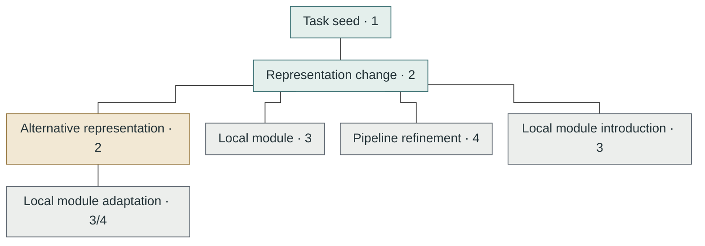

## Seven-paper synthetic evolution

Corpus scope: Seven synthetic papers only; no global priority or real literature claims.

> Synthetic example — not real scientific evidence. Source links are synthetic examples, not reader-test targets.

> Sources, declared notes and reader behavior have not been verified.

1: seminal milestone task; 2: seminal pipeline/representation; 3: seminal module; 4: module augmentation of an existing pipeline. These are contribution types, not quality scores.

### Placement overview

Lines show structural membership only, not scientific inheritance. Scientific relations remain complete below; this is not the final evolution figure.

### Papers

- **Synthetic Task Seed** — Declared note (not checked): `resources/papers/paper-one/Paper.md`

- **Synthetic Representation** — Declared note (not checked): `resources/papers/paper-two/Paper.md`

- **Synthetic Alternative** — Declared note (not checked): `resources/papers/paper-three/Paper.md`

- **Synthetic Module** — Declared note (not checked): `resources/papers/paper-four/Paper.md`

- **Synthetic Refinement** — Declared note (not checked): `resources/papers/paper-five/Paper.md`

- **Synthetic Mixed Contribution** — Declared note (not checked): `resources/papers/paper-six/Paper.md`

- **Synthetic Unclassified Resource** — Declared note (not checked): `resources/papers/paper-seven/Paper.md`

### Contributions

#### Task seed

Paper: Synthetic Task Seed

Novelty types: 1 · Main

Structural parent: None declared

**Classification basis:** Introduces the bounded synthetic task, not a global priority claim. **(Author statement)** — [Synthetic Task Seed · physical page 1 · Synthetic task definition](zotero://open-pdf/library/items/ABCD2345?page=1)

#### Representation change

Paper: Synthetic Representation

Novelty types: 2 · Main

Structural parent: Task seed

**Classification basis:** Introduces a representation within this synthetic corpus. **(Author statement)** — [Synthetic Representation · physical page 3 · Synthetic representation](zotero://open-pdf/library/items/BCDE3456?page=3)

#### Alternative representation

Paper: Synthetic Alternative

Novelty types: 2 · Major branch

Structural parent: Representation change

**Classification basis:** The synthetic evidence supports a distinct representation, not higher quality. **(Analysis inference)** — [Synthetic Alternative · physical page 5 · Synthetic alternative](zotero://open-pdf/groups/456/items/CDEF4567?page=5)

#### Local module

Paper: Synthetic Module

Novelty types: 3 · Local

Structural parent: Representation change

**Classification basis:** Introduces a local module without main-line eligibility. **(Author statement)** — [Synthetic Module · physical page 4 · Synthetic module](zotero://open-pdf/library/items/DEFG5678?page=4)

#### Pipeline refinement

Paper: Synthetic Refinement

Novelty types: 4 · Local

Structural parent: Representation change

**Classification basis:** Reports a local pipeline refinement under the stated protocol. **(Experimental result)** — [Synthetic Refinement · physical page 7 · Synthetic refinement experiment](zotero://open-pdf/library/items/EFGH6789?page=7)

#### Local module introduction

Paper: Synthetic Mixed Contribution

Novelty types: 3 · Local

Structural parent: Representation change

**Classification basis:** The first contribution introduces a synthetic local module. **(Author statement)** — [Synthetic Mixed Contribution · physical page 6 · Synthetic module introduction](zotero://open-pdf/library/items/FGHJ789A?page=6)

#### Local module adaptation

Paper: Synthetic Mixed Contribution

Novelty types: 3/4 · Local

Structural parent: Alternative representation

**Classification basis:** A separate contribution combines module introduction and pipeline adaptation. **(Analysis inference)** — [Synthetic Mixed Contribution · physical page 8 · Synthetic adaptation](zotero://open-pdf/library/items/FGHJ789A?page=8)

#### Pending contribution

Paper: Synthetic Unclassified Resource

Novelty types: Unclassified · Pending

Structural parent: None declared

**Classification basis:** Contribution type is not established within the synthetic corpus. **(Unverified / not yet analyzed)**

### Relations

#### Task seed → Representation change · Extension

**Change:** Changes the synthetic input representation while retaining the declared task. **(Author statement)** — [Synthetic Representation · physical page 3 · Synthetic method change](zotero://open-pdf/library/items/BCDE3456?page=3)

**Reason:** The synthetic authors motivate this choice by a representation bottleneck. **(Author statement)** — [Synthetic Representation · physical page 3 · Synthetic motivation](zotero://open-pdf/library/items/BCDE3456?page=3)

**Benefit:** The synthetic comparison reports a benefit only under its matched protocol. **(Experimental result)** — [Synthetic Representation · physical page 9 · Synthetic comparison table](zotero://open-pdf/library/items/BCDE3456?page=9)

**Cost:** The synthetic experiment reports an additional memory cost. **(Experimental result)** — [Synthetic Representation · physical page 9 · Synthetic resource table](zotero://open-pdf/library/items/BCDE3456?page=9)

**Conditions:** Comparison requires the same synthetic data split, metric and evaluation budget. **(Author statement)** — [Synthetic Representation · physical page 10 · Synthetic evaluation protocol](zotero://open-pdf/library/items/BCDE3456?page=10)

#### Alternative representation → Representation change · Comparison

**Change:** Compares two synthetic representations without asserting inheritance. **(Analysis inference)** — [Synthetic Alternative · physical page 5 · Synthetic comparison scope](zotero://open-pdf/groups/456/items/CDEF4567?page=5)

**Reason:** The synthetic comparison tests a different representational tradeoff. **(Analysis inference)** — [Synthetic Alternative · physical page 5 · Synthetic comparison rationale](zotero://open-pdf/groups/456/items/CDEF4567?page=5)

**Benefit:** The synthetic experiment reports a protocol-specific outcome, not universal superiority. **(Experimental result)** — [Synthetic Alternative · physical page 11 · Synthetic outcome table](zotero://open-pdf/groups/456/items/CDEF4567?page=11)

**Cost:** The synthetic source does not report a matched resource cost. **(Not reported (input assertion))**

**Conditions:** Do not rank unmatched synthetic tasks or differently measured metrics. **(Author statement)** — [Synthetic Alternative · physical page 11 · Synthetic comparison limits](zotero://open-pdf/groups/456/items/CDEF4567?page=11)
